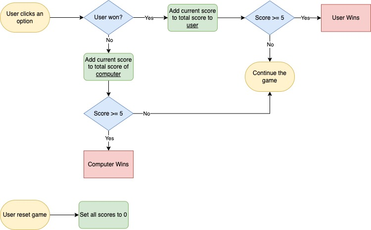
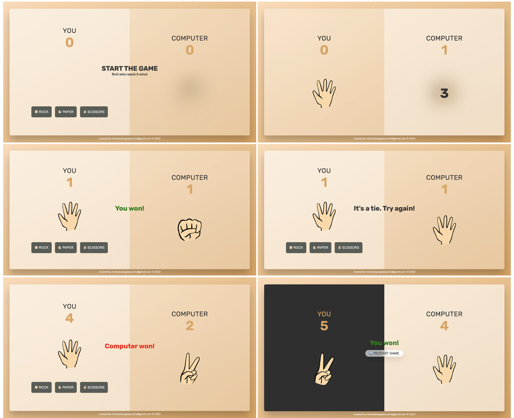

# ✌🏻 Rock Paper Scissors Game

Rock Paper Scissors Game where user can play and try to beat the computer. The first one who reach the score 5 wins! The user can play as many times as they want. This simple game was developed using JavaScript.

## Tech Stack
`HTML 5`,  `SASS`, `JavaScript`, `Git`

## Flowchart




## App Screens

 
## Run Locally

Install dependencies (this will install `sass` and `live-server`)

```bash
  npm install
```

Start the server

```bash
  npm run start
```

Build CSS

```bash
  npm run build:css
```

## License

> Read license [here](LICENSE.txt)

